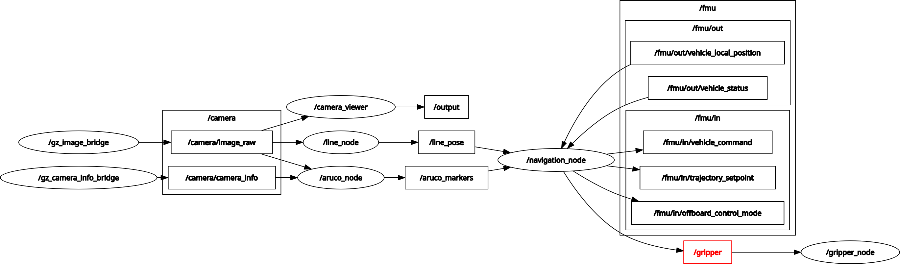

# PX4-ROS2-Gazebo Drone Simulation Template

This repository provides a template to set up a simulation environment for a quadcopter equipped with a camera. It integrates PX4, Gazebo Harmonic, and ROS2 Jazzy, enabling the development and testing of software for a drone with a companion computer. This environment is ideal for mission planning and computer vision applications. A Python example script is included to demonstrate how to control the drone and access the camera feed, serving as a starting point for further development.

 

## Directory Structure

- **`PX4-Autopilot_PATCH/`**  
  Contains custom worlds, models, and configurations to be copied into the PX4 installation. These files extend the default PX4 setup with additional simulation environments and drone models.

- **`ws_ros2/`**  
  The ROS2 workspace where custom ROS2 nodes are developed and built. It includes the `my_offboard_ctrl` package, providing an example of drone control using ROS2.

## Installation

This setup is tested on Ubuntu 24.04 and might not be compatible with its derivatives (e.g., Linux Mint).

1. Clone the repository and run the installation script:
   ```bash
   cd ~
   git clone --recursive https://github.com/Mi-LeV/PX4-ROS2-Gazebo-Drone-Simulation-Template.git
   cd ~/PX4-ROS2-Gazebo-Drone-Simulation-Template
   ./install_px4_gz_ros2_for_ubuntu.sh
   ```

2. Copy the custom worlds and models into the PX4 installation:
   ```bash
   cd ~/PX4-ROS2-Gazebo-Drone-Simulation-Template
   cp -r ./PX4-Autopilot_PATCH/* ~/PX4-Autopilot/
   ```
  THIS ACTION IS MANDATORY EVERY TIME THE MODELS OF THE DRONE OR WORLD ARE CHANGED

3. ( Install **QGroundControl**. )

## Usage (First Launch)

[](https://raw.githubusercontent.com/Mi-LeV/PX4-ROS2-Gazebo-Drone-Simulation-Template/main/media/launch_tuto.mp4)


### 1. ( Launch QGroundControl ) - OPTIONAL

- Open **QGroundControl**.

### 2. Start the Micro XRCE-DDS Agent

- In a new terminal, start the Micro XRCE-DDS Agent:
  ```bash
  MicroXRCEAgent udp4 -p 8888
  ```
  The Micro XRCE-DDS Agent allows uORB messages to be published and subscribed to on a companion computer as ROS 2 topics, and is making the liaison with the PX4 flight computer.

### 3. Run PX4 SITL and Gazebo

- In another terminal, launch PX4 SITL with Gazebo:
  ```bash
  PX4_SYS_AUTOSTART=4010 \
  PX4_SIM_MODEL=gz_x500_down_cam \
  PX4_GZ_MODEL_POSE="2.2,2.5,0.1,0,0,1.57" \
  PX4_GZ_WORLD=test_world \
  ~/PX4-Autopilot/build/px4_sitl_default/bin/px4
  ```
  - `PX4_SYS_AUTOSTART=4010` defines the airframe to be used by PX4. The **4010** airframe is the default for **x500_down_cam** and is equivalent to the **4001** airframe.
  - `PX4_SIM_MODEL=gz_x500_down_cam` specifies the model to load in Gazebo.
  - `PX4_GZ_MODEL_POSE="1,1,0.1,0,0,0.9"` sets the initial pose of the vehicle.
  - `PX4_GZ_WORLD=test_world` defines the Gazebo world to be loaded.

  In case of error message `ERROR [gz_bridge] Service call timed out.` try again.

### 4. Build and run the ROS2 nodes

- In a new terminal, build and run the `image_processing` package :
  ```bash
  cd ~/PX4-ROS2-Gazebo-Drone-Simulation-Template/ws_ros2 ; colcon build --packages-select image_processing ; source install/local_setup.bash ; ros2 launch image_processing image_processing.launch.py
  ```

- In another terminal, build and run the navigation script:
  ```bash
  cd ~/PX4-ROS2-Gazebo-Drone-Simulation-Template/ws_ros2 ; colcon build --packages-select navigation_script ; source install/local_setup.bash ; ros2 launch navigation_script navigation_script.launch.py
  ```
### STRUCTURE



The `image_processing` package runs : 
- `gz_image_bridge`, `gz_camera_info_bridge` : those nodes pass the camera topics from Gazebo to ROS2, OR RPI3 camera topics to ROS2 when the parameter `use_sim` is set to true ( `use_sim:=false` )
- `aruco_node`, `line_node` : those nodes process the camera image from `camera/image_raw`, and publish their output into `aruco_markers` and `line_pos` respectively. 
`aruco_markers` contains the markers IDs, and the 3D poses of the arucos ; `line_node` contains the 2D pose of the yellow-green line ( it returns NaN if nothing is detected ).
- `gripper_node` : this node moves the gripper servomotor on the RPI by controlling the PWM signal on pin 18, it uses the string topic `/gripper` with the valid commands open and close.

The `navigation_script` package runs : 
- `navigation_node` : this node receives information from all the processing nodes, excecute the navigation startegy ( arm, takeoff, follow the line, ...) and communicates with the PX4 via the `/fmu/in` and `/fmu/out` topics (created with the MicroXRCE Agent) to send position and velocity commands. 
- `camera_viewer` : this node just displays the camera image from `camera/image_raw` to the user.

Philosophy : 
- Launch the `image_processing` launch script and let it run in the background
- Launch the `navigation_script` launch script to start the flight !
